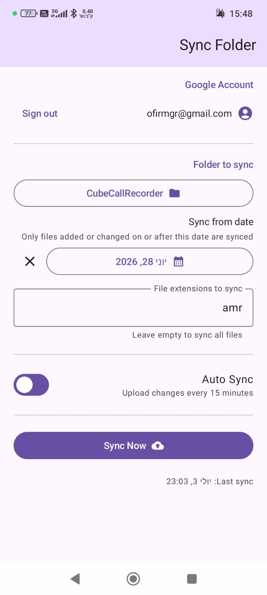

# Sync Folder

Android app that syncs a local folder to your Google Drive (one-way upload).

## App Screenshot



- Picks any folder via Android's system folder picker (SAF)
- Uploads new/changed files to a matching folder in your Drive (`drive.file` scope — visible in My Drive)
- Auto-syncs every 15 minutes in the background via WorkManager
- Skips unchanged files using size + modification time

---

## Setup

### 1. Install toolchain

```bash
brew install --cask temurin@17      # JDK 17
brew install --cask android-studio  # includes Android SDK + adb
```

Open Android Studio once, let it install the SDK components, then open this project (`File → Open → sync-folder/`). Gradle sync runs automatically.

### 2. Get the Gradle wrapper JAR (command-line builds only)

Android Studio handles this automatically. For CLI builds:

```bash
./bootstrap.sh      # downloads gradle-wrapper.jar
./gradlew assembleDebug
```

### 3. Create Google Cloud credentials (automated)

```bash
brew install --cask google-cloud-sdk   # install gcloud if needed
./setup-gcloud.sh                      # creates project, enables API, opens browser for OAuth clients
```

The script automates: project creation, Drive API enablement, SHA-1 extraction, and writing `local.properties`. It opens the browser for the two OAuth client steps that Google provides no CLI API for.

Or manually — see the inline comments in `local.properties`.

### 4. Build and install

```bash
# From Android Studio: Run ▶
# Or CLI (after bootstrap.sh + setup-gcloud.sh):
./gradlew installDebug
```

---

## Usage

1. Open the app → **Sign in with Google** → grant Drive access when prompted
2. Tap **Pick a folder** → navigate to the folder you want to sync
3. Tap **Sync Now** to upload immediately
4. Toggle **Auto Sync** to upload every 15 minutes when connected

Files appear in Google Drive under a folder matching your local folder's name.

---

## Architecture

```
SyncScreen (Compose) ──▶ SyncViewModel ──▶ AuthManager    (Credential Manager + Identity)
                                      ├──▶ DriveClient    (OkHttp + Drive REST v3)
                                      ├──▶ SyncEngine     (DocumentFile tree walk + diff)
                                      ├──▶ SyncWorker     (CoroutineWorker via WorkManager)
                                      ├──▶ AppDb / Room   (per-file sync state)
                                      └──▶ Prefs          (DataStore — URI, token, settings)
```
